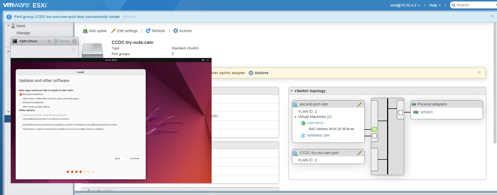

#### INject #1 Intro to Networking -design 

### Inect #1 C 
### Subject: Intro to Networking - design 

Dear AB CEO of the CEOs,
Setting up the ESXI was a little difficult because I have not set one up before, but i was able to play around witht the exsi system to set up the topology that you wanted. the problem i was running into was not having the ISO file for Linux so one of the network leads had to come over 
