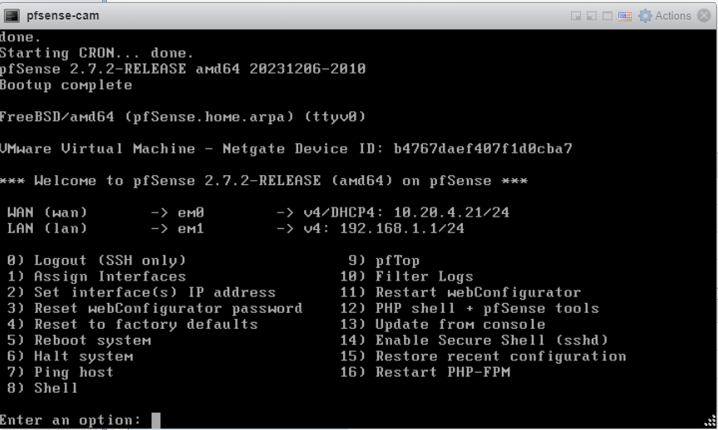
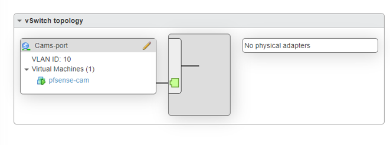
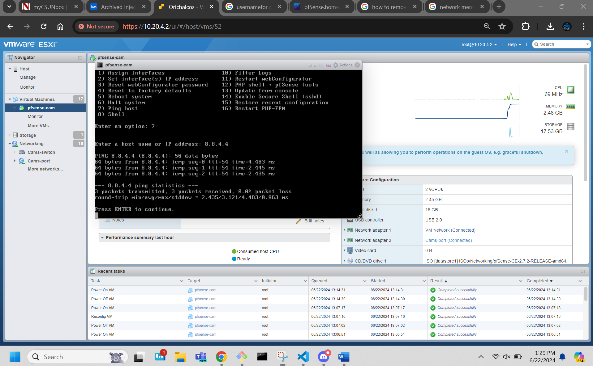
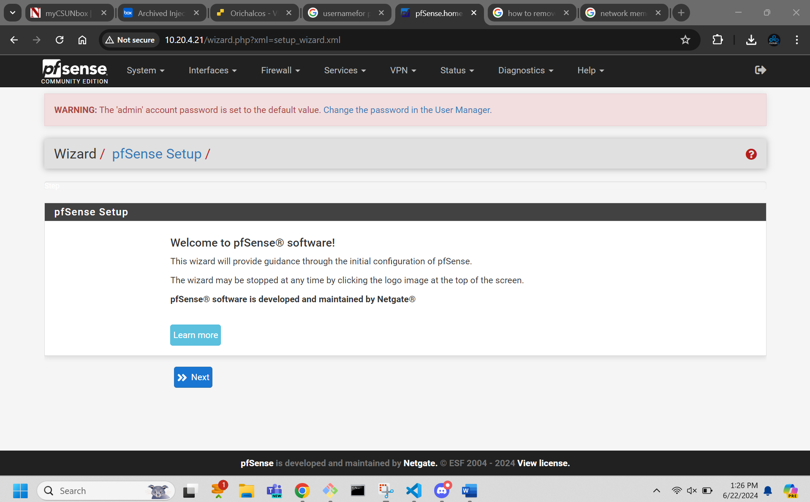

Hello Muhibian,

This is what the network team setup for your ticket please reach out if there is something else you need,

The setup for WAN and LAN we can see that the WAN is set up and in the next couple screenshots we can see that the LAN is up and running. 

Here we have setup a bus network topology 

This screenshot focus on proof that there was an active internet connection

In the Screenshot we have proof of the Web config

Here is a meme for the networking 

