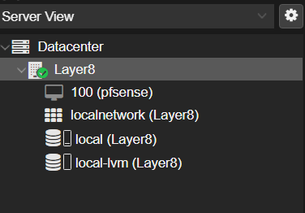

## Setting up pfsense on proxmox 

Assuming you have proxmox installed on a second computer some where im just going to write about setting up a virtual Network on Proxmox and setting up pfsense on the network as well as allow traffic to be passed through.

### Proxmox Vlan Configuration

In proxmox it uses something called a linux bridge, its is just a logical construct in proxmox that allows you to connect the physical network adapters into proxmox as well as allowing promox itself to be able to understand things like vlans we're going to look at this default bridge. 

1. We want to make sure we are looking at the summary screen
	> To be sure we are on the summay screen we will click on the host name for are proxmox server , for this test we will click layer8

 

 1. Now that you can see everything on the machine click on the systems drop-down and click on the network tab.
 	> Here you can see the default setup for proxmox with your network and there vm network.

 	